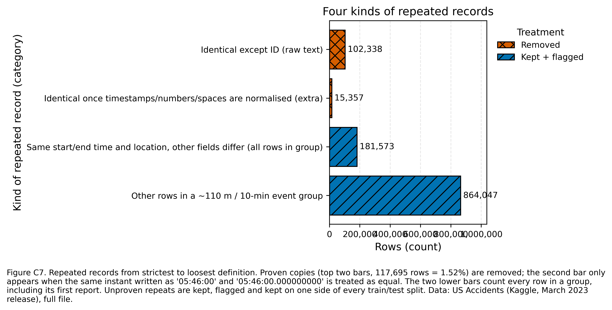
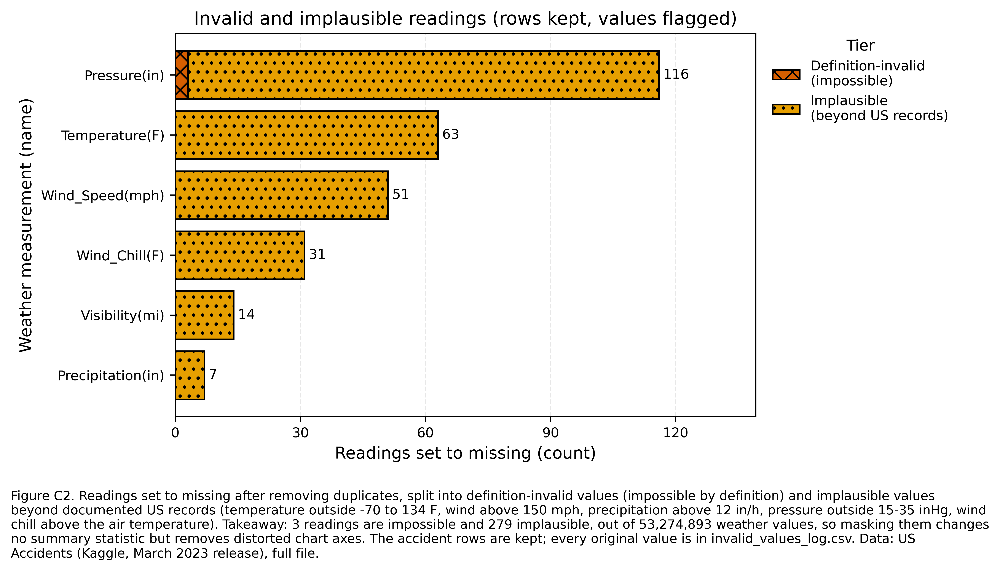
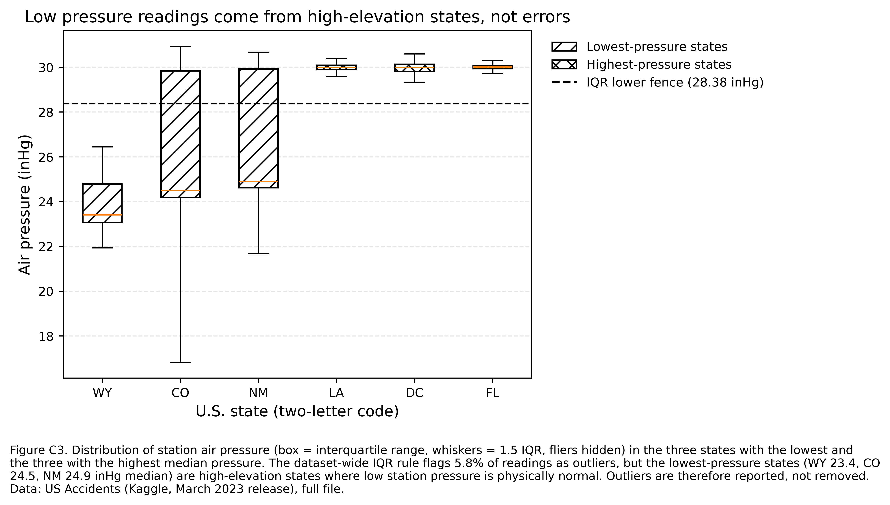
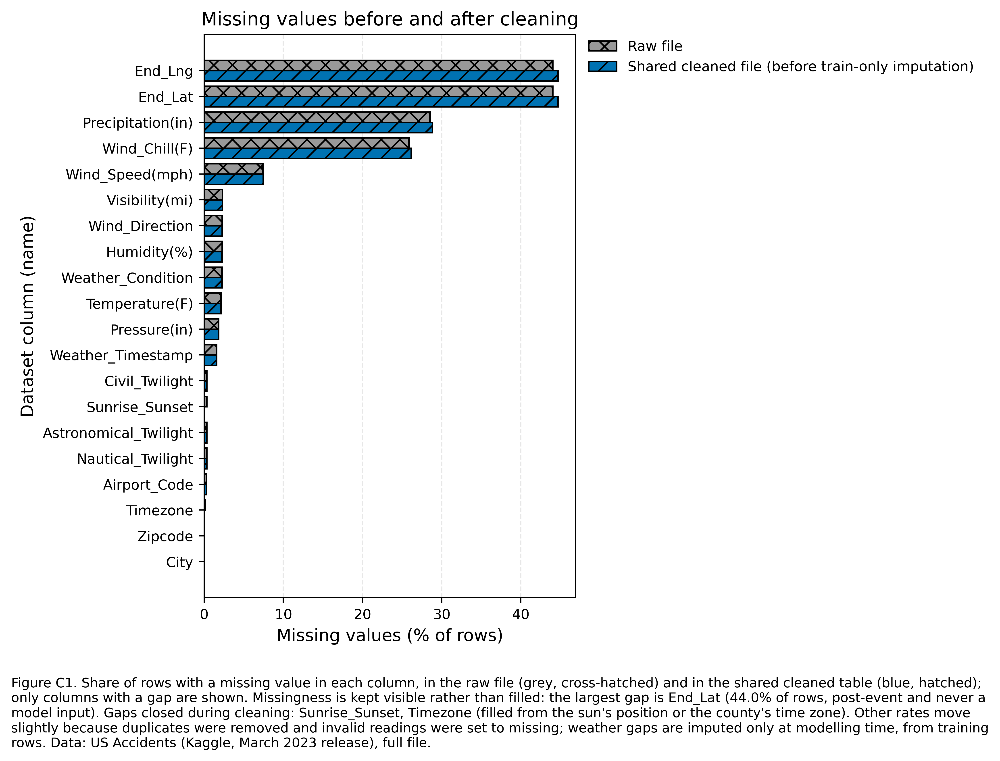
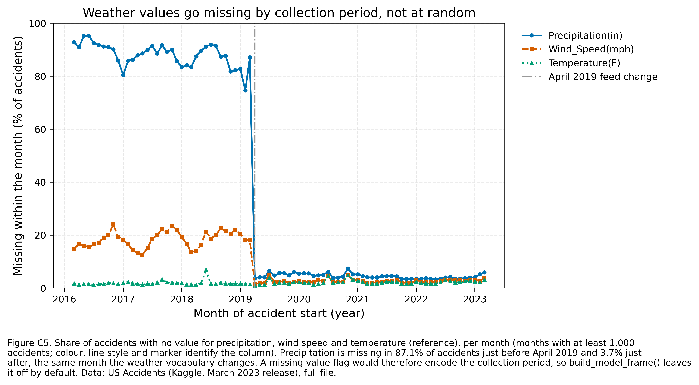
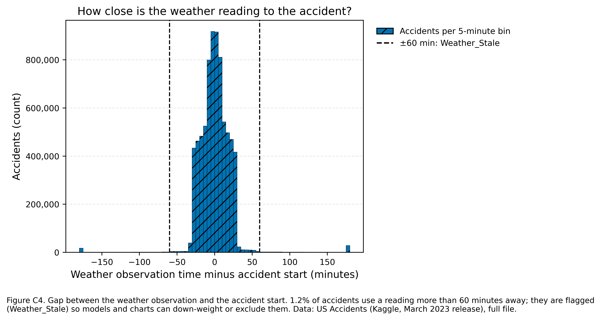
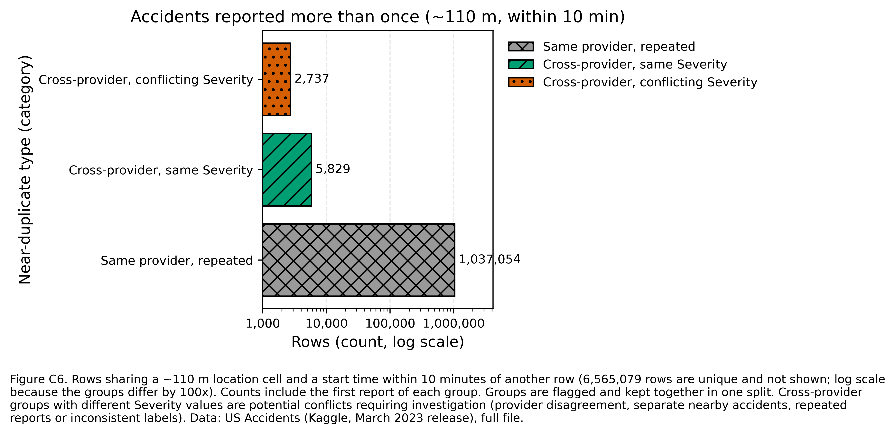

# US Accidents (2016–2023): Data Cleaning and Processing

**DATA 230 Group Project — Data Cleaning and Processing section**
Saida Mahmood · San José State University · Fall 2026
Project repository: <https://github.com/FlorenceOTATO-index/team-data-visualization>

---

## 1. Purpose and scope

This section prepares the U.S. Accidents dataset for the rest of the project: the exploratory analysis, the dashboard and the preliminary machine-learning direction. The project question is *which patterns in time, geography, weather and road conditions are associated with differences in accident severity*. The goal of the cleaning work is therefore one shared, documented dataset in which:

- every accident is counted once;
- every value is either valid, or missing with a recorded reason;
- nothing that is only known *after* an accident can leak into a severity model;
- every decision can be reproduced from code.

The full file is used throughout (7,728,394 rows); no sampling was done.

## 2. The dataset

| Item | Value |
|---|---|
| Source | US Accidents (2016–2023), Kaggle, March 2023 release (`US_Accidents_March23.csv`, 3.06 GB) |
| Size | 7,728,394 rows × 46 columns |
| Target | `Severity` (1–4, impact on traffic) |
| Coverage | Contiguous United States, 49 states incl. DC; January 2016 – March 2023 |
| Providers | Three data sources (`Source1`–`Source3`) |

The columns fall into nine groups: an identifier (`ID`), the target, the provider, time (`Start_Time`, `End_Time`), accident extent (`End_Lat`, `End_Lng`, `Distance(mi)`), free text (`Description`), location (`Street`, `City`, `County`, `State`, `Zipcode`, `Timezone`, coordinates), weather (`Airport_Code`, `Weather_Timestamp`, eight measurements, `Weather_Condition`, `Wind_Direction`), thirteen True/False road features and four day/night indicators.

**Severity is strongly imbalanced** (raw file): Severity 1 = 67,366 (0.87%), Severity 2 = 6,156,981 (79.67%), Severity 3 = 1,299,337 (16.81%), Severity 4 = 204,710 (2.65%). The largest class is 91 times the smallest, so later modelling must not rely on accuracy alone.

## 3. Data-quality problems found

A full-file audit (all rows, read in 500,000-row blocks with every column as text) found the following problems. Most of them raise no error in pandas and would silently distort the analysis.

| Problem | Evidence (raw file) |
|---|---|
| Hidden duplicates | The `ID` is unique, so a normal duplicate check finds 0 duplicates. Without `ID`, 102,338 rows are exact copies; 15,357 more appear once the same instant written in two formats is treated as equal (117,695 in total, 1.52%). |
| Two timestamp formats | 743,166 start times carry a `.000000000` suffix; date inference would turn them into missing values. |
| Missing values | 22 columns. Largest gaps: `End_Lat`/`End_Lng` 44.03%, `Precipitation(in)` 28.51%, `Wind_Chill(F)` 25.87%, `Wind_Speed(mph)` 7.39%; other weather fields about 2%. |
| Missingness that depends on the collection period | Precipitation is missing in 87.1% of accidents in March 2019 and in 3.7% in April 2019, for every provider (Figure C5). |
| Invalid readings that look like numbers | Maximum temperature 207 °F, wind speed 1,087 mph, precipitation 36.47 in/h, pressure 0 inHg. |
| Station artefacts | One station (KJRB) reports precipitation of exactly 9.93–10.00 in/h about 370 times; two stations report visibilities of 60–100 miles. |
| Implausible end times | 4,229 accidents last more than a year; 93,903 weather readings were taken more than one hour from the accident. |
| Inconsistent text | 1,696,520 `Street` values and 4,454 descriptions with leading or trailing spaces; "Unknown" used as a description 34 times; 111 city names and 48 county names written in more than one letter case. |
| Inconsistent categories | `Wind_Direction` uses 24 labels for 18 directions (e.g. `CALM`/`Calm`, `W`/`West`); `Weather_Condition` has 144 labels, and in April 2019 three labels were replaced by synonyms (Clear → Fair, Overcast → Cloudy, Thunderstorm → T-Storm; 1,193,320 rows). |
| Mixed code formats | `Zipcode` mixes 5-digit (5,458,211), ZIP+4 (2,265,251) and other formats (3,017). |
| Constant columns | `Country` (always US) and `Turning_Loop` (always False). |
| Leakage risk | `End_Time`, `End_Lat`, `End_Lng`, `Distance(mi)` and `Description` describe the accident after it happened. |
| Label differences by provider and time | Severity 3 is 20.1% of accidents before May 2022 but 2.8% afterwards. |

## 4. Cleaning methodology

The pipeline runs in three passes. Steps that need no information from other rows run block by block, so they cannot leak information between rows; steps that need the whole dataset run once on a small set of key columns.

1. **Audit (pass 1).** Count everything above and compute a fingerprint of every row (all columns except `ID`, after normalising timestamps, numbers and whitespace).
2. **Row-level cleaning (pass 2).** Remove proven duplicates, validate the target, parse dates, set invalid readings to missing, convert types, standardise labels, create features, and write the result as Parquet blocks.
3. **Global steps (pass 3).** Group repeated reports of the same accident, assign two train/test splits, and fit imputation values on training rows only.

Design principles:

- **Mask values, never delete accidents.** An invalid reading becomes missing and gets a flag; the accident row stays.
- **Keep missingness visible.** The shared table is not imputed; imputation happens only when a model is built, using training rows only.
- **Remove only what is proven.** Exact copies are removed; probable repeats are flagged.
- **Every column has a role** (`feature`, `label_process`, `leakage_post_event`, `eda_only`, `quality_flag`, `split`, `target`, `identifier`), so the model can only use columns that are known when an accident is first reported.
- **Every threshold is a named constant** in `src/us_accidents_cleaning.py`, and every masked value is logged with its original reading.

## 5. Cleaning steps and rationale

### 5.1 Duplicates

`ID` is unique, so it hides duplicate content; rows are therefore compared without it. Comparing the raw text finds 102,338 copies. Comparing what each row *means* — timestamps cut to the same format, numbers parsed, whitespace trimmed — finds 15,357 more: the same record stored once as `05:46:00` and once as `05:46:00.000000000`. **117,695 rows were removed**, keeping the first copy (Figure C7).

Two looser kinds of repetition were **flagged, not removed**, because they are not proven duplicates:

- **181,573 rows** share the exact start time, end time and location with another row but differ in other fields (`Same_Event_Repeat`), e.g. an updated report of the same incident.
- **1,045,620 rows** fall into 435,150 groups of reports within about 110 m and 10 minutes of each other (`Event_Key`); 8,566 of them involve two different providers.

Every row of a group is kept on the same side of each train/test split, so a model is never tested on a report of an accident it was trained on. Groups whose reports carry different Severity values (147,120 rows) are potential conflicts requiring investigation: they may reflect provider disagreement, separate nearby accidents grouped by the heuristic, repeated reports, or inconsistent labels.



### 5.2 Target

`Severity` was checked to be 1–4 in every row (0 invalid values) and is never imputed or changed.

### 5.3 Timestamps

All three timestamp columns are parsed from their first 19 characters with an explicit format (`%Y-%m-%d %H:%M:%S`), with a strict ISO-8601 retry for anything else; **0 start times failed to parse.** Durations that are negative or longer than one year are set to missing (3,636 rows after removing duplicates). Seven accidents start before the documented February 2016 coverage; they are kept and flagged (`Before_Coverage`).

### 5.4 Invalid and implausible readings

Readings are checked in two tiers. Both tiers set the value to missing, add a `*_was_invalid` flag, keep the accident row, and write the original value to `invalid_values_log.csv`.

- **Definition-invalid (impossible):** violates the definition of the quantity — pressure ≤ 0 inHg, humidity outside 0–100%, negative amounts, temperatures below absolute zero, coordinates outside the contiguous United States. **3 readings** (pressure = 0).
- **Implausible:** inside the definition but beyond documented U.S. records — temperature outside −70 to 134 °F, wind speed above 150 mph, precipitation above 12 in/h, pressure outside 15–35 inHg, visibility above 100 miles, wind chill above the air temperature. **279 readings.**

In total **282 values** were masked (pressure 116, temperature 63, wind speed 51, wind chill 31, visibility 14, precipitation 7) out of roughly 53 million weather values (Figure C2). The station-specific precipitation values of 9.93–10.00 in/h at KJRB pass the 12-inch limit and remain in the data; they are listed in the audit for a team decision.



### 5.5 Outliers

Values that are valid but far from the bulk were **reported, not removed** (Tukey fences, 1.5 × IQR). A generic outlier rule would delete real weather: it flags 19.6% of visibility readings (every value other than 10 miles), 9.7% of precipitation readings (every non-zero amount) and 5.8% of pressure readings. The low pressure readings come from high-elevation states — median 23.4 inHg in Wyoming, 24.5 in Colorado and 24.9 in New Mexico — where low station pressure is physically normal (Figure C3).



### 5.6 Missing values

Missing values stay visible in the shared table (Figure C1); how they are filled depends on the column's role:

| Column(s) | Missing (raw) | Treatment |
|---|---|---|
| `End_Lat`, `End_Lng` | 44.03% | Kept for EDA; never a model input (post-event, recorded by one provider only) |
| `Precipitation`, `Wind_Speed`, `Visibility`, `Humidity`, `Temperature`, `Pressure` | 1.8–28.5% | Imputed at modelling time with State × Month medians (then State, then overall) fitted on training rows only |
| `Wind_Chill(F)` | 25.87% | Kept for EDA; not a model input (correlation 0.994 with temperature) |
| `Wind_Direction`, `Weather_Condition` | 2.2–2.3% | Explicit `Unknown` category at modelling time |
| `Sunrise_Sunset` | 0.30% | **Filled from the sun's position** at the accident's time and place (22,724 rows). The calculation agrees with the provider's own label for 99.77% of 7,587,972 accidents. |
| `Timezone` | 0.10% | Filled from the county's time zone, or from the state when the whole state has one zone (7,703 rows, flagged `Timezone_was_filled`); 3 rows stay missing because 24 states span several time zones |

**Missing-value flags are not used as model inputs by default.** Precipitation is missing for 86–89% of accidents before April 2019 and for 4–7% afterwards, for every provider (Figure C5). A "was missing" flag would therefore tell the model *when* an accident was recorded rather than anything about the road.





### 5.7 Data types and inconsistent labels

- Booleans "True"/"False" → 0/1; numbers → float32; repeated text → categories.
- Whitespace and letter case standardised (e.g. 111 city names written in several cases now match); placeholder text such as "Unknown" → missing.
- `Wind_Direction`: 24 labels → 18 (CALM, VAR and 16 compass points).
- `Weather_Condition`: the April 2019 vocabulary change was harmonised (1,193,320 rows), and the 144 labels were grouped into weather families (`Weather_Group`), with "N/A Precipitation" (3,252 rows) kept as its own group.
- `Zipcode` is kept as text; a 5-digit `Zip5` was added.

### 5.8 Feature creation

| New column | Purpose |
|---|---|
| `Start_Year`, `Start_Month`, `Start_DayOfWeek`, `Start_Hour`, `Is_Weekend`, `Is_Rush_Hour`, `Is_Holiday` | Time patterns (local clock time; U.S. federal holidays) |
| `Road_Type` | Interstate, freeway/expressway, U.S./state highway or local road, from the street name |
| `Region` | U.S. Census region (lookup on `State`; 0 unmatched states) |
| `Weather_Group`, `Weather_Windy` | Weather families and a windy indicator |
| `Weather_Lag_min`, `Weather_Stale` | Gap between the weather reading and the accident; flagged when more than 60 minutes (Figure C4) |
| `Weather_Period` | Before / from April 2019 (collection-period marker) |
| `Duration_min` | End minus start time, for EDA and the dashboard only (post-event) |
| Duplicate and quality flags, `Split`, `Split_Time` | Bookkeeping described above |



### 5.9 Merging and joining

No second dataset was merged: the accident, location, road and weather information are already in one row. Two lookups add context without changing the row count — U.S. Census regions and the federal holiday calendar — and both were checked (0 unmatched states).

### 5.10 Columns removed, modified and created

Only the two constant columns (`Country`, `Turning_Loop`) were removed. The other 44 original columns were cleaned and kept, so the EDA and the dashboard can still use them. 35 columns were created. **The shared table therefore has 79 columns, but the baseline model uses only the 33 columns with the role `feature`:**

| Role | Columns | Meaning |
|---|---|---|
| feature | 33 | Known when the accident is first reported (location, weather, road features, time of day) |
| quality_flag | 19 | Audit flags (invalid readings, duplicates, fills) |
| eda_only | 13 | Useful for charts, too detailed for a model (`City`, `Zipcode`, raw `Weather_Condition`, …) |
| leakage_post_event | 6 | Known only afterwards (`End_Time`, `End_Lat`, `End_Lng`, `Distance(mi)`, `Duration_min`, `Description`) |
| label_process | 4 | Describe how Severity was labelled (`Source`, `Start_Year`, `Start_Month`, `Weather_Period`) — a team decision |
| split / target / identifier | 2 / 1 / 1 | `Split`, `Split_Time` / `Severity` / `ID` |

## 6. Data-leakage controls

| Risk | Control | Check |
|---|---|---|
| Post-event fields used as predictors | Role `leakage_post_event`; `build_model_frame()` refuses them | 0 post-event columns in the model input |
| Same accident in training and test data | Splits assigned per event group | 0 groups in both halves, for both splits |
| Test data influencing imputation | Medians fitted on training rows of each split separately (`imputation_stats.csv` for the chronological split, `imputation_stats_random.csv` for the random split) | Overall median temperature 63 °F (chronological training rows) vs 64 °F (random training rows) |
| Collection period hidden in missingness | Missing-value flags and `Weather_All_Missing` are not model inputs | — |
| Provider and year shaping the label | `Source`, `Start_Year`, `Start_Month`, `Weather_Period` excluded unless the team opts in | — |

**Two splits are provided.** `Split_Time` holds out the most recent 18% of accidents (from 1 May 2022: 1,361,783 rows; training 6,248,916) and is the primary test, because it measures how a model would perform on future accidents. `Split` is a random 80/20 split grouped by event (6,089,098 / 1,521,601). The chronological split shows strong label drift — Severity 3 is 20.1% of training accidents but 2.8% of hold-out accidents, and Severity 1 rises from 0.5% to 2.6% — so a random split alone would overstate model performance.

## 7. Results: before and after

| | Before (raw file) | After (shared cleaned table) |
|---|---|---|
| Rows | 7,728,394 | **7,610,699** |
| Columns | 46 | **79** (44 cleaned + 35 created; 2 removed) |
| Size on disk | 3.06 GB (CSV) | **0.81 GB** (16 compressed Parquet files; 74% smaller) |
| Duplicate rows | 117,695 | 0 |
| Unparsed timestamps | 743,166 at risk | 0 |
| Invalid or implausible readings | 256 in the raw file | 0 (282 masked after duplicate removal, all logged) |
| Invalid Severity | 0 | 0 |
| `Wind_Direction` labels | 24 | 18 |
| Missing `Sunrise_Sunset` / `Timezone` | 23,246 / 7,808 | 0 / 3 |
| Severity 1 / 2 / 3 / 4 | 67,366 / 6,156,981 / 1,299,337 / 204,710 | 65,570 / 6,048,391 / 1,295,235 / 201,503 |

Removing duplicates barely changes the class balance (Severity 2: 79.67% → 79.47%), so the cleaning did not distort the target.



## 8. Challenges and solutions

The challenges fell into two groups: problems hidden in the data itself, and practical problems of processing a 3 GB file on a free cloud machine.

### 8.1 Data challenges

**1. Duplicates that a normal check cannot see.** Every row has a unique `ID`, so `duplicated()` reports zero duplicates. *Solution:* compare rows without `ID`, which revealed 102,338 copies. A second, harder problem appeared next: 15,357 more copies differ only in how the timestamp is written (`05:46:00` vs `05:46:00.000000000`). *Solution:* compare a fingerprint of each row's meaning — timestamps cut to the same format, numbers parsed, whitespace trimmed — which found all 117,695 copies.

**2. Deciding what counts as "the same accident".** Beyond exact copies, 181,573 rows share the start time, end time and location with another row, and about one million rows fall within 110 m and 10 minutes of another report. Deleting them would remove real reports; keeping them unmarked would let the same accident appear in both training and test data. *Solution:* flag them, keep them, and assign every report of the same event to the same side of each train/test split. Groups with different Severity values (147,120 rows) are recorded as potential conflicts for investigation rather than treated as errors.

**3. Timestamps in two formats.** 743,166 start times carry a fractional-seconds suffix. Letting pandas guess the format would silently turn them into missing values — no error is raised. *Solution:* parse the first 19 characters with an explicit format, retry anything else with a strict ISO-8601 parser, and count failures (0).

**4. Invalid values that look like normal numbers.** A wind speed of 1,087 mph or a pressure of 0 inHg is not missing, so `isna()` does not find it. The harder question was where to draw the line: some values are impossible by definition, others only implausible. *Solution:* two tiers — 3 definition-invalid readings and 279 readings beyond documented U.S. records — both set to missing and flagged, with every original value logged so the decision can be reversed.

**5. "Outlier" is not the same as "error".** A standard IQR rule flags 19.6% of visibility readings and 5.8% of pressure readings. Checking where the low pressures come from showed high-elevation states (Wyoming median 23.4 inHg, Colorado 24.5), where they are physically normal. *Solution:* use physical limits for errors and IQR only for reporting.

**6. Missing values that are not random.** Precipitation is missing for 87.1% of accidents in March 2019 and 3.7% in April 2019, for every provider — the same month the weather vocabulary changed. A "was missing" flag would therefore tell a model *when* an accident was recorded, not anything about the road. *Solution:* keep missingness visible, exclude missing-value flags from the default model, and impute only at modelling time with State × Month medians from training rows.

**7. The same category written several ways.** `Wind_Direction` uses 24 labels for 18 directions, and in April 2019 three weather labels were replaced by synonyms (1,193,320 rows). *Solution:* a mapping to 18 canonical directions and a harmonisation of the replaced weather labels, followed by grouping into weather families.

**8. Filling time zones correctly.** 7,808 rows had no time zone, which is also needed to compute day/night, but 24 states span more than one time zone, so filling from the state could be wrong (for example, El Paso, Texas uses Mountain time). *Solution:* fill from the county's own time zone, use the state only when the whole state has one zone, and flag every fill; 3 rows stay missing.

**9. Severity labels that change over time.** Severity 3 is 20.1% of accidents before May 2022 but 2.8% afterwards. A random split would hide this and overstate model performance. *Solution:* a chronological hold-out split, with imputation values fitted on its own training rows.

**10. A faulty weather station.** One station (KJRB) reports precipitation of exactly 9.93–10.00 in/h about 370 times — almost certainly an instrument error, but within the 12-inch limit. *Solution:* the audit lists repeated extreme values with their station; the masking decision is left to the team (section 11).

### 8.2 Processing challenges

**11. A 3 GB file on a machine with about 12 GB of memory.** Loading every column as text for 7.7 million rows needs far more memory than the file size. *Solution:* read the file in 500,000-row blocks, store repeated text as categories, and load only the key columns for the final step.

**12. Session crashes.** An early run restarted the Colab session, most likely because memory ran out while the cleaned data was being loaded back: combining all 21 text columns before compressing them creates a large temporary peak. After a crash every variable is lost, so the next cell failed with `NameError: name 'OUT_DIR' is not defined`. *Solution:* compress each block as it is loaded, avoid full copies of the table, and save a checkpoint after each slow step so that **Run all** resumes where the session stopped. A version number in each checkpoint prevents old results from being reused after the cleaning rules change.

**13. Long run times with no visible progress.** The first full cleaning pass ran for more than 18 minutes without any output, making it impossible to tell whether it was working. *Solution:* progress messages for every block, and two speed-ups that leave the results unchanged: each distinct text value is cleaned once instead of once per row, and each row's fingerprint is computed once and reused. The final full run takes about 23 minutes on free Colab.

**14. Running the same code on a laptop and in Colab.** Colab cannot read files on a personal computer, and the notebook first failed with `ModuleNotFoundError` because the cleaning code was in a separate file. *Solution:* the notebook writes its own cleaning module, finds the CSV in Google Drive (or unzips the Kaggle archive), copies it to fast local disk, and saves all results back to Drive; a separate version runs in Jupyter on a laptop.

**15. Computing day/night without a time-zone database.** Calculating the sun's position needs universal time, but the standard time-zone database was not available in every environment. *Solution:* U.S. time-zone offsets and daylight-saving rules are built into the code; the result agrees with the provider's own day/night label for 99.77% of accidents.

| # | Challenge | Solution | Outcome |
|---|---|---|---|
| 1 | Duplicates hidden by `ID` and two timestamp formats | Fingerprint of each row's meaning | 117,695 removed |
| 2 | Probable repeats of the same accident | Flag, keep, split by event | 0 events in both training and test |
| 3 | Two timestamp formats | Explicit format + strict retry | 0 unparsed |
| 4 | Invalid values that look valid | Two-tier rules, values logged | 282 masked, rows kept |
| 5 | Outlier vs error | Physical limits; IQR for reporting only | Real extremes kept |
| 6 | Missingness tied to the collection period | Flags excluded; training-only imputation | No period shortcut in the model |
| 7 | Inconsistent labels | Canonical mappings | 24 → 18 directions; 1,193,320 weather labels harmonised |
| 8 | Time zones in multi-zone states | County-level fill | 7,703 filled, 3 left missing |
| 9 | Labels changing over time | Chronological split | Honest future-period test |
| 10 | Faulty station | Listed for a team decision | Open |
| 11–12 | Memory limits and crashes | Blocks, compression, checkpoints | Full run completes on free Colab |
| 13 | Slow runs without progress | Progress messages, faster text cleaning | About 23 minutes |
| 14–15 | Different environments | Self-contained notebook; built-in time-zone rules | Runs in Colab and Jupyter |

## 9. Improvements over my Assignment 2 cleaning

My Assignment 2 cleaning already processed the full file in blocks, compared rows without `ID`, parsed timestamps explicitly, masked invalid readings with flags, excluded post-event columns and fitted medians on training rows only. For the group project I extended it:

- duplicates are compared on normalised values (15,357 more found);
- probable repeats are grouped and kept together across train/test splits;
- the shared table keeps all original columns and missingness, with a role for every column;
- invalid readings are split into two tiers with record-based limits, and every masked value is logged;
- imputation uses State × Month medians instead of one national median, separately for each split;
- day/night and time zone gaps are filled from evidence (solar position, county);
- the April 2019 collection break is detected and handled;
- a chronological split was added;
- the code runs on free Colab with checkpoints.

## 10. Hand-off to the team

| File (repository path) | Use |
|---|---|
| `notebooks/DATA230_Cleaning_Colab.ipynb` | The full cleaning run with all outputs |
| `src/us_accidents_cleaning.py` | All cleaning functions and the loading helpers |
| `data/clean/us_accidents_clean/` | Cleaned table (16 Parquet files, 0.81 GB; not committed — rebuilt by the notebook) |
| `data/clean/data_dictionary.csv` | Type, role, missing % and distinct values of every column |
| `data/clean/imputation_stats.csv`, `imputation_stats_random.csv` | Training-only medians for each split |
| `data/clean/invalid_values_log.csv` | Every masked value with its original reading and tier |
| `data/clean/report_numbers.csv` | Every number in this report |
| `figures/cleaning_C1–C7.png` | Cleaning figures (500 dpi) |

```python
import us_accidents_cleaning as uc
df = uc.load_clean("data/clean/us_accidents_clean")              # EDA and dashboard
stats = uc.load_imputation_stats("data/clean/imputation_stats.csv")
X_train, y_train = uc.build_model_frame(df[df.Split_Time == "train"], stats)   # 33 model inputs
X_test,  y_test  = uc.build_model_frame(df[df.Split_Time == "test"],  stats)
```

For accident **counts** on the dashboard, exclude exact repeats (`Same_Event_Repeat`) rather than whole event groups; for rates and models, use all rows.

## 11. Decisions for the team

1. **KJRB precipitation values (9.93–10.00 in/h, about 370 readings):** almost certainly an instrument error. Mask them, or keep them as they are?
2. **Label-process columns** (`Source`, `Start_Year`, `Start_Month`, `Weather_Period`): leave them out of the baseline model (default) or include them?
3. **Evaluation:** use the chronological split as the headline result, with the random split as a secondary check.

## 12. How to run the code

### Option A — Google Colab (no installation)

1. In Google Drive, create the folder `MyDrive/D230` and upload `US_Accidents_March23.csv` (or the Kaggle `archive.zip`). If neither is there, the notebook downloads the dataset from Kaggle.
2. Open `DATA230_Cleaning_Colab.ipynb` in Colab (**File → Upload notebook**).
3. Choose **Runtime → Run all** and allow access to Google Drive.
4. Wait for **"All checks passed."** (about 23 minutes). Progress lines such as `cleaning: block 9 saved` show it is working.
5. If the session disconnects, choose **Runtime → Run all** again; finished steps are skipped.
6. Results are saved in `MyDrive/D230/`: `figures/`, `data/clean/` and `src/`.

### Option B — Your own computer (Jupyter)

1. Install the packages once: `pip install pandas numpy matplotlib pyarrow jupyter`
2. Open `DATA230_Cleaning_Local.ipynb` and set `CSV_PATH` in the first code cell to the location of `US_Accidents_March23.csv`.
3. Choose **Kernel → Restart & Run All** and wait for **"All checks passed."** Results are saved next to the CSV.
4. With 16 GB of RAM or more, `READ_WHOLE_FILE = True` reads the CSV once; the results are identical.

### Committing to GitHub

Commit the notebook with its outputs, `src/us_accidents_cleaning.py`, `figures/` and the small files in `data/clean/`. Do not commit the raw CSV, the Parquet folder or `data/clean/checkpoints/`; the provided `.gitignore` excludes them.

---

## Appendix A. Presentation material (about 2.5 minutes)

**Slide 1 — "7.7 million records, problems that raise no error"** (Figure C7)
- 117,695 duplicate rows hidden by a unique ID; 15,357 of them only visible when timestamps are compared as instants
- 743,166 timestamps in a second format; 282 invalid weather readings such as 1,087 mph wind
- Weather gaps depend on when the data was collected (precipitation missing 87% → 4% in April 2019)

**Slide 2 — "Every decision has a reason"** (Figure C5 or C2)

| Issue | Decision | Because |
|---|---|---|
| Duplicates | Remove proven copies; flag probable repeats | Count each accident once without deleting real reports |
| Invalid readings | Set to missing, flag, log | Keep the accident; remove only the error |
| Pressure "outliers" | Keep | High-elevation states (Figure C3) |
| Missing weather | Impute from training rows only, by state and month | Climate differs by state and season |
| Post-event fields | Never model inputs | Known only after the accident |

**Slide 3 — "One leakage-safe dataset for the team"**
- 7,610,699 rows × 79 columns (0.81 GB, down from a 3.06 GB CSV); every column has a role; 33 model inputs
- Chronological split: Severity 3 falls from 20.1% to 2.8% — a random split would overstate performance
- Reproducible: one notebook, checkpoints, all numbers in `report_numbers.csv`
- Challenges solved: hidden duplicates, invalid values that look normal, non-random missingness, a 3 GB file on a free 12 GB machine (blocks, checkpoints after crashes)

**Speaking script.** "My part was turning the raw file into one dataset the team can trust. The file has 7.7 million accidents and 46 columns, and most of its problems raise no error. Every row has a unique ID, so a normal duplicate check finds nothing; without the ID, 102,338 rows are copies, and 15,357 more appear once we notice the same time written in two formats — 117,695 duplicates removed in total. We also found readings like a wind speed of 1,087 miles per hour. We set those values to missing and flagged them instead of deleting the accident, and we logged every original value. Missing weather turned out not to be random: precipitation is missing for 87% of accidents before April 2019 and 4% after, so we keep missing values visible and fill them only for modelling, from training data, by state and month. We kept genuine extremes — low pressure readings come from mountain states — and we kept every column for the dashboard, but tagged each one so that fields known only after an accident, like its end time or distance, can never enter a model. Finally, we split the data by time: Severity 3 drops from 20% of accidents to under 3% in the latest period, so testing on future accidents gives an honest picture. The result is 7.6 million rows and 79 columns, with a data dictionary and a function that gives the team a leakage-safe training set."
