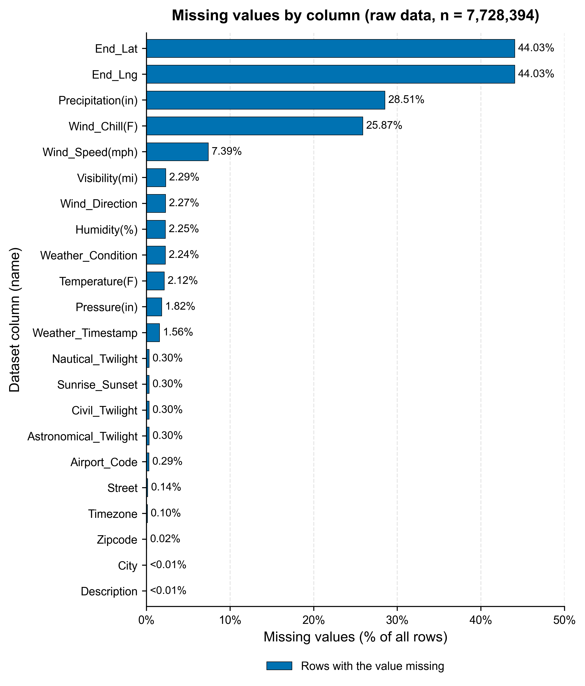
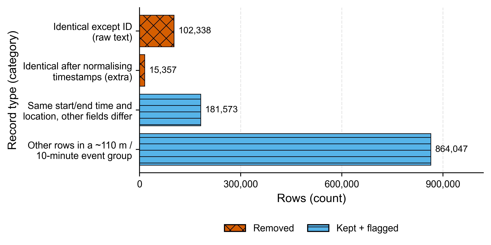
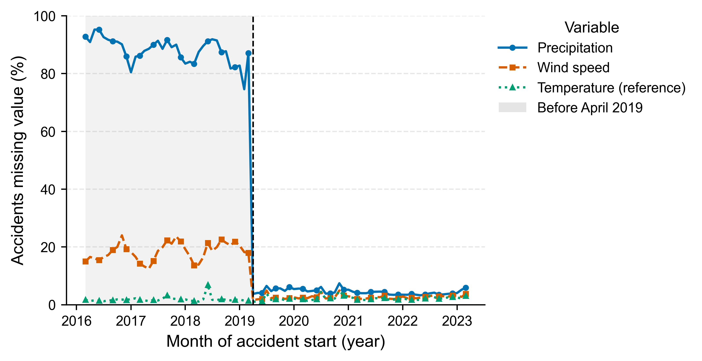
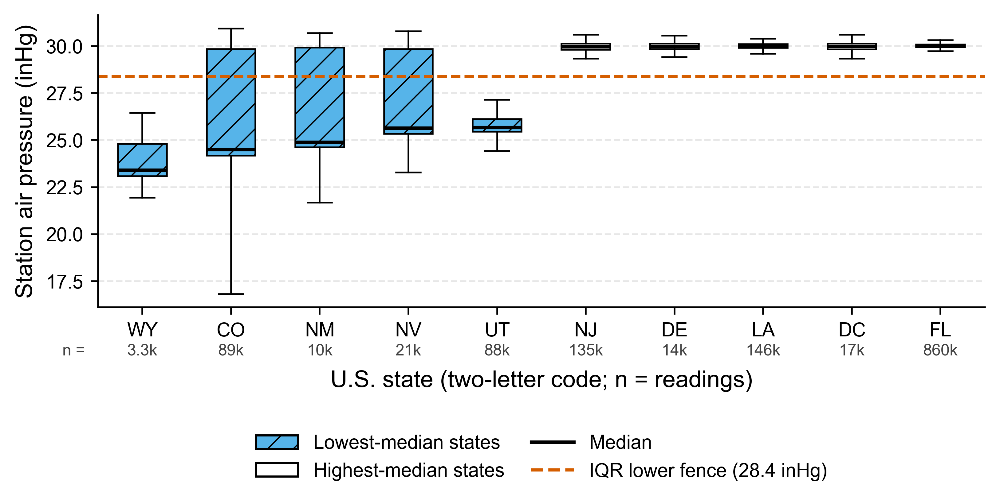
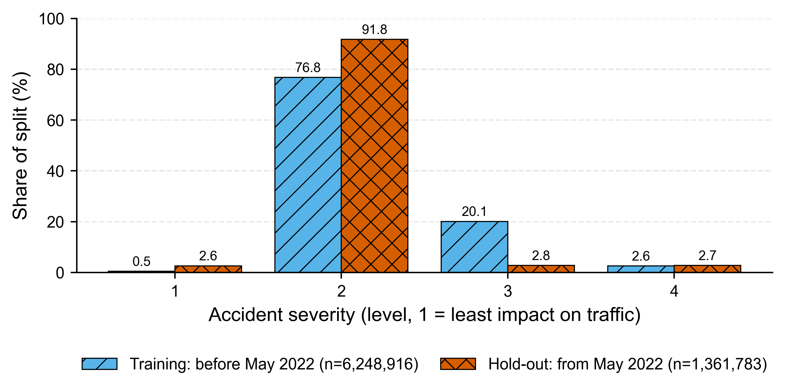

**Figure 1. Missing values by column in the raw data.** Share of the 7,728,394 raw rows with no value in each column; columns without gaps are not shown. 22 of 46 columns have gaps. The largest are the end coordinates (44.0%, recorded after the accident and never used as model inputs), precipitation (28.5%) and wind chill (25.9%); all other weather fields are below 7%. Missing values were kept visible in the cleaned table and imputed only at modelling time, from training rows, because their pattern follows the data-collection period (Figure 3). *Data: US Accidents (Kaggle, March 2023 release), full file.*

**Figure 2. Four kinds of repeated records, from strictest to loosest definition.** Proven copies (top two bars, 117,695 rows) were removed, keeping the first copy; the second bar only appears when the same instant written as '05:46:00' and '05:46:00.000000000' is treated as equal. The lower bars count every row of a group, including its first report; these probable repeats were kept, flagged, and assigned to one side of every train/test split so that no accident is in both training and test data. *Data: US Accidents (Kaggle, March 2023 release), full file.*

**Figure 3. Weather values are missing by collection period, not at random.** Monthly share of accidents with no precipitation, wind-speed or temperature value (months with at least 1,000 accidents); the shaded area is the period before the April 2019 change in weather data. Precipitation is missing for 87.1% of accidents in the month before the change and 3.7% in the month after, for every provider. A 'value was missing' indicator would therefore encode when an accident was recorded, so missing-value flags are not used as model inputs by default. *Data: US Accidents (Kaggle, March 2023 release), full file.*

**Figure 4. Low air-pressure readings come from high-elevation states, not from errors.** Station air pressure in the 5 states with the lowest and the 5 with the highest median (boxes: interquartile range; whiskers: 1.5 × IQR; line: median; outliers not drawn; n under each state). A dataset-wide IQR rule would flag 5.8% of all readings below the dashed fence, yet the low-median states (WY 23.4, CO 24.5, NM 24.9 inHg) are high-elevation states where low station pressure is physically normal. Statistical outliers were therefore reported, not removed. *Data: US Accidents (Kaggle, March 2023 release), full file.*

**Figure 5. Severity labels change over time.** Share of accidents at each severity level in the chronological training period and the hold-out period (the most recent 18% of accidents). Severity 3 falls from 20.1% to 2.8% and Severity 1 rises from 0.5% to 2.6%. A random split would hide this drift, so the chronological split is the primary test of future performance. *Data: US Accidents (Kaggle, March 2023 release), full file.*